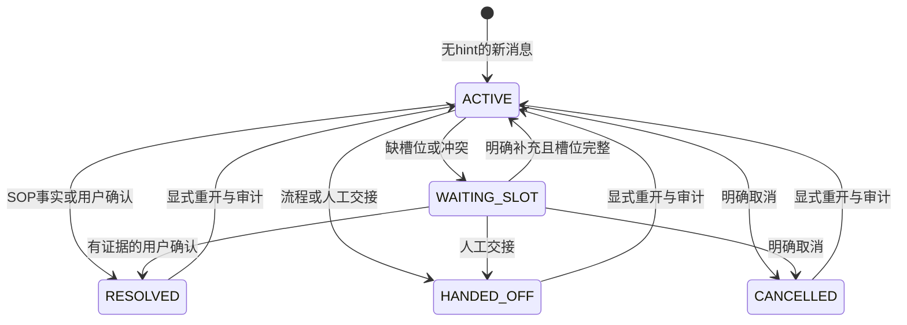

# M10｜多层记忆、Question 生命周期与状态事实源

**阶段：** C 核心深化

**前置：** M02, M08

**来源：** 原 PDF 文件页 55–66、69。以下未由原文给出的实现细节均为本复刻方案的工程要求。

## 本模块目标
让“同一个用户在说哪个问题、哪些信息已确认、问题何时结束”成为明确的业务状态，而不是把历史聊天全部塞进大模型。复刻 JIMDB/DB/Milvus 的职责分工，用 Redis/MySQL/向量投影实现。

## 身份与生命周期
tenant/user/session/question/message 的作用、幂等键和唯一约束遵循 M02。一个 session 可有多个开放 question（ACTIVE、WAITING_SLOT，及仅作受控上下文的 WAITING_APPROVAL），不能只有一个 current_question 字符串覆盖全部。实体更正有来源和版本，原订单的记录不能被新订单静默污染。

状态转移定义 ACTIVE↔WAITING_SLOT、WAITING_APPROVAL、RESOLVED、HANDED_OFF、CANCELLED；RESOLVED 后新消息何时新建问题、何时显式重开，要有策略和审计。TTL 只管缓存保留，不等于业务自动解决。确定结束条件以工具事实/用户确认/流程结果为依据，不因模型语气肯定就结束。

## 三层存储职责
MySQL 保存 messages、cases、entities、status/version、operation/approval 基础结构；Redis 保存有 TTL 的短期历史窗口、关键词/活跃 case 缓存，缓存丢失可从 MySQL 重建；Milvus 保存可重建的事件向量/摘要与 status/version 投影。原文 zset/query/keywords/questionId 关系可以保留功能，但不能用 Redis 唯一保存幂等锁、资金结果或审批。

用同一业务事务写 outbox，再由轻量 worker 幂等更新 Redis/Milvus。投影更新失败、重试和乱序应按 event/version 处理。检索命中后回查 MySQL 的归属/状态/版本，避免已解决问题仍以 ACTIVE 被召回。不要承诺在 MySQL+Redis+Milvus 上天然强一致。

## 记忆读取
提供 MemoryPort/CaseRepository：获取有界历史、已确认实体、活跃问题列表、相关已结问题摘要。按 token/条数/时间限制窗口；引用保留 message_id，让错误聚合可还原。摘要是派生数据，不能覆盖原始事实或合并冲突编号。

## 必测案例
同用户两问题交错、不同用户相同订单字符串、重复消息、乱序补充、实体更正、隔离缓存丢失后恢复、Milvus stale ACTIVE、outbox 重复/乱序、进程重启、关闭问题后新起相似问题、长历史裁剪。并发修改至少采用版本检查或等价受控串行，不能 last-write-wins 丢掉确认信息。

交付业务状态图、表/schema 与约束、缓存键规范及 TTL、outbox 投影契约、回放/清理策略和实际 MySQL/Redis 集成测试。checkpoint 接入留 M15，先把业务事实权威说清楚。

## 接口与分期边界

“开放问题”明确包含 ACTIVE、WAITING_SLOT；WAITING_APPROVAL 只作受授权的上下文候选，普通新消息不能批准/恢复挂起run。原图 ACTIVE 过滤在本项目扩展状态机中不是直接照搬的枚举条件。基于 M08 账本增量迁移，审批执行逻辑仍留 M15。缓存丢失通过隔离测试实例或本测试专用前缀模拟，禁止对共享 Redis 执行 FLUSHALL/FLUSHDB。

## 实现状态机与存储约束

增量迁移保留M08三表：messages保存原文和唯一幂等键；runs移除question唯一索引，允许同问题多run，并保留RUNNING不可重领；questions保存实体、来源、更正链、未确认字段、状态和版本。新增表：

| 表 | 内容与约束 |
|---|---|
| dh_m10_sessions | tenant/user/session主键、单调generation；短事务串行同session事实变化 |
| dh_m10_members | tenant/user/channel/message主键，question和occurred_at索引；历史引用不会只靠文本编号 |
| dh_m10_outbox | event_id主键、question/version唯一；完整Question快照与变更证据，done/attempts/lease/error为投影进度 |

旧M08消息按原occurred_at换算UTC回填成员关系，当前问题回填一份事件，原接收/结果不改写。事实写入、成员关系、generation和outbox在同一事务提交。正常版本/归属冲突回滚并归还连接；未知中断断开连接回滚。MySQL行锁不跨模型、Redis或Milvus调用。

Redis键为`deephelp:m10:<scope-hash>:g<generation>`，关键词键追加`:keywords`；hash包含完整tenant/user/session，不含明文身份。窗口和关键词在同一Redis事务写入，默认TTL300秒，可配置；无latest指针，旧generation不会覆盖新事实。默认历史30条、24小时、文本UTF-8字节8192作为保守token上界，开放/已结列表各最多32；限制可通过repository参数调整。裁剪保留引用及truncated标记，原文仍完整在MySQL。请求读取一致的有界MySQL快照并刷新缓存，因此缓存不可用有诊断且不丢事实。

事件向量集合使用`dh_m10_events_<signature>`，schema含scope、question_id、version、status、summary、message_ids、真实Embedding vector；id为question/version摘要，同版本upsert幂等，旧版本保留为派生历史。签名或物理schema不同需新集合/reindex；不复用M05/M09意图集合。摘要只描述当前意图/状态/确认实体及消息引用，不生成业务结论。

worker在短事务中领取事件，120秒lease和唯一token防旧worker确认新任务；随后最多90秒执行远程投影，两目的地都成功才CAS确认。重复投递/乱序安全，失败保存异常类型且保持pending，默认最多5次领取，CLI遇到失败退出；不循环重试不可恢复错误。重建先保留MySQL/签名配置；`memory_cli rebuild --session`重新投影该主体/session全部最新问题并刷新snapshot缓存，超出显式limit即退出，不把截断当完整恢复；pending事件可另用worker回放。更换集合/签名后必须rebuild，旧done不代表新目标已重建；需要重新领取耗尽重试的事件时，运维只重置指定事件的投影进度，禁止改业务body/version或重放业务工具。清理只删除已核对的专用键/集合，事实与审计保留；缓存TTL和清理都不关闭业务问题。

运行入口见[应用README](../../modules/deephelp-app/README.md#m10多问题记忆)，接口见[CONTRACTS](../CONTRACTS.md#m10-多问题记忆契约)，实际证据见[M10交接](../../handoffs/M10.md)。
