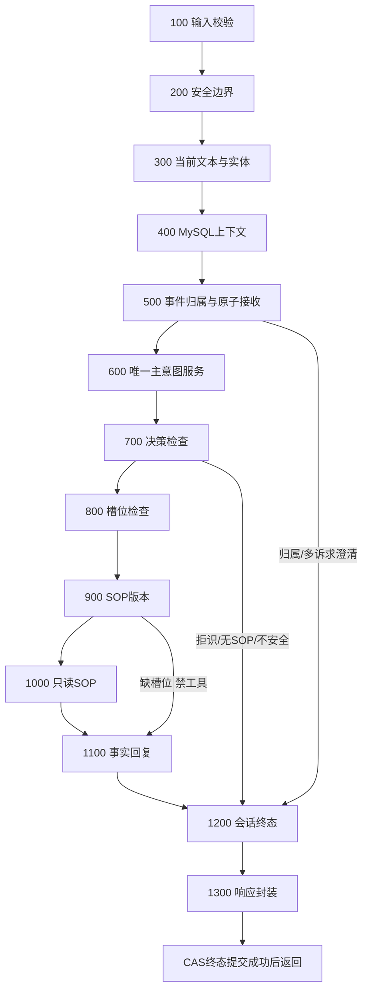

# M12｜四阶段意图决策与完整 13 段 Pipeline

**阶段：** C 核心深化

**前置：** M04, M08, M09, M10, M11

**来源：** 原 PDF 文件页 19–20、31–35、53、57–60、69。以下未由原文给出的实现细节均为本复刻方案的工程要求。

## 本模块目标
把原文的规则、检索、记忆增强和模型兜底组合成一个具有明确接管/拒识语义的决策服务，再将多轮事件聚合后的信息接入 13 段主链。不能把每段写成一次大模型调用。

## 识别级联
第一层是高确定性规则，带排除条件；第二层是当前事件文本 Hybrid 检索；第三层只在需要时用 M10 已确认的历史/实体构造增强查询再次检索；第四层通过统一 FallbackPort 做受控判断。FastText 在 M13 未完成前 disabled，采用已有的有限 LLM 兜底或转人工，不捏造分类模型输出。

定义每层的输入、候选保留、阈值/差距、反证、accept/continue/clarify/handoff 的条件。不同来源得分不能共享一条 0.9 阈值；规则冲突、多意图、分数接近、工具不可支持的意图应允许拒识。LLM 只能从注册表选 code 或明确 unknown，不允许发明代码。

“M600 主识别只调用一次”指主流程只进入一次统一决策服务；它内部允许预算内的多阶段检索/必要模型调用，两种次数分别计量。EventCluster 负责聚合而非再分类，SOP 负责执行而非重分类，避免回旋链路。

## 13 段完整接线
沿用 M00 的顺序，节点输入输出 typed state；清晰设置哪个节点可短路以及响应状态。缺槽位→WAITING_SLOT，无可用 SOP→HANDOFF，不安全→REJECTED，服务故障→可恢复错误/接管。对已接收的有效业务请求，session维护与响应封装不能被普通早返回绕过；权限失败不写入不属于该用户的业务数据。

对副作用前的检查用确定性节点；状态 reducer 的合并语义要写明，不能并行节点随意覆盖同一个 entities 字段。状态只保存必要字段和引用，不把全量向量/客户端塞进 checkpoint 候选状态。

## 必测
每一层单独命中、每层失败后下探、所有层拒识、相同事件重放一致性、超时消耗预算后停止、模型给不存在code、检索高分但实体冲突、同session多问题选择正确、少槽位时禁止执行工具、SOP缺失时不自行编流程。断言每个请求主识别调用次数与模型/检索尝试次数。

交付级联决策表、阈值配置及来源、完整图定义/节点trace、短路测试矩阵、dev 集调参记录和旧 MVP 回归。不得借机更换整个项目框架或把简单节点全部 Agent 化。

## 接口与分期边界

在 M08 同一图/服务上替换已标注的 passthrough、增强检索和上下文节点，回归原MVP行为，不并存两套流水线。统一使用 Response.outcome=REJECTED；IntentDecision.decision=reject 是另一层枚举。离线固定fixture/相同版本要求策略重放一致，真实随机模型不承诺逐字/候选顺序完全一致；安全与业务状态不变量必须始终成立。

## 实施机制与决策表

复用现有Conversation，运行见[应用入口](../../modules/deephelp-app/README.md#m12-完整聚合与意图级联)，接口见[契约](../CONTRACTS.md#m12-完整主链与级联契约)。旧无事件Port的离线MVP消费者保持兼容；正式live装配自动归属及统一级联，M09指针启用Hybrid，M05指针保留无分数接管的兼容模式。

| 层 | 接管或短路 | 下探/反证 |
|---|---|---|
| 已绑定事件 | 保持已确认意图，按实际槽位accept/clarify | 当前规则与绑定矛盾报INVALID_ARGUMENT，不重分类 |
| 规则 | 唯一有排除条件/原文证据的叶子 | 无规则继续；多类clarify；用户明确不查询handoff |
| 当前Hybrid | top1过本层fusion阈值及差距，证据、scope、排名、实体约束一致 | 缺候选、接近、低分、冲突、未校准继续 |
| 记忆增强Hybrid | 只有已关联且尚未绑定意图的当前事件；有出处原文+确认实体，独立阈值/差距 | 不用其他开放问题或闭合摘要猜；无此上下文跳过；超长handoff |
| FallbackPort | 一次结构化判断，只能注册叶子或unknown | multiple澄清，unknown/不合法代码handoff；服务/预算失败停止 |

门限配置为`sample_data/m12_policy.json`，绑定M09 scope、语料摘要、0.5融合权重及dev摘要。预定threshold=0.55/0.65/0.75/0.85/0.95，margin=0.05/0.1/0.2/0.3，选dev错误接管0且正确接管最多，平局选更严格门限。当前fusion=0.85/0.05，记忆fusion=0.85/0.3；cosine/BM25禁直接接管。18条现有dev及由它们生成的18条带出处/确认实体增强查询，分别接管5/18与6/18，错误接管0；增强组不是新的独立dev集，未用M09 test选择这些门限。小合成校准不证明企业接管概率。每层必测由独立固定端口输出控制，真实随机模型只要求安全/状态不变量。

## 图、状态与短路

`PreparedState`只含Receipt/TextEntityResult/MemoryWindow/EventClusterResult/安全错误，后续使用唯一Question与决策。300并行清洗/提取后join；400/500/600及状态合并串行。500实体来源按M04合并，更正保留previous/replacement，不以摘要或召回样本生成实体。1200构造version+1及终态，1300验证响应，之后有界CAS提交；实际存储耗时单列`ledger_committed`，提交失败不会返回成功封装。

| 场景 | 600 | 工具 | 终态行为 |
|---|---:|---:|---|
| 正常/已关联补槽/必要记忆增强 | 1 | 按SOP实际尝试 | 有验证事实才ANSWERED/RESOLVED |
| 归属歧义/多个独立主诉 | 0 | 0 | CLARIFY、独立待澄清消息，1200/1300执行 |
| 单类但缺/冲突槽位 | 1 | 0 | CLARIFY/WAITING_SLOT |
| 未知/无SOP | 1 | 0 | HANDOFF，不编流程 |
| 不安全业务决策 | 1 | 0 | REJECTED；未授权hint接收前拒绝 |
| 预处理故障/超时 | 0 | 0 | 已接收后FAILED，仍完成终态节点 |
| 工具后取消 | 至多1 | 保留已dispatch ID | CANCELLED、无成功事实、取消传播 |
| 同消息终态回放 | 0 | 0 | 原事实/图，当前call_counts和预算0 |

未实现FastText、审批/业务写、框架替换或回复模型润色；未以M12宣称15+情境或500+企业效果。
